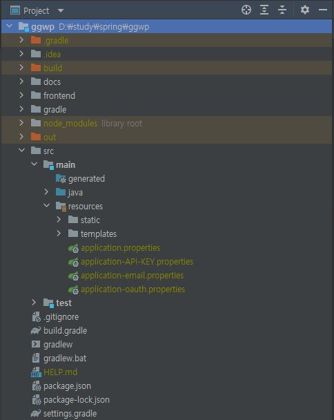
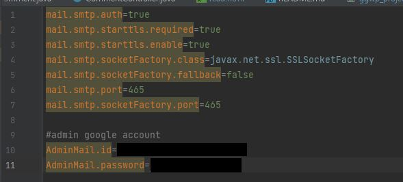

# GGWP
리그 오브 레전드 전적검색 사이트 토이 프로젝트입니다.
전적검색 프론트엔드로는 Raect, 백엔드 및 커뮤니티 사이트는 Spring Boot Framework & Thymeleaf를 사용했습니다.

### 전적검색 프론트엔드 ( React )

### 백엔드 및 커뮤니티 사이트 ( Spring Boot Framework & Thymeleaf )

### 프로젝트 구조

**application.properties**

**application-API-KEY.properties**

**application-oauth.properties**

**application-email.properties**

